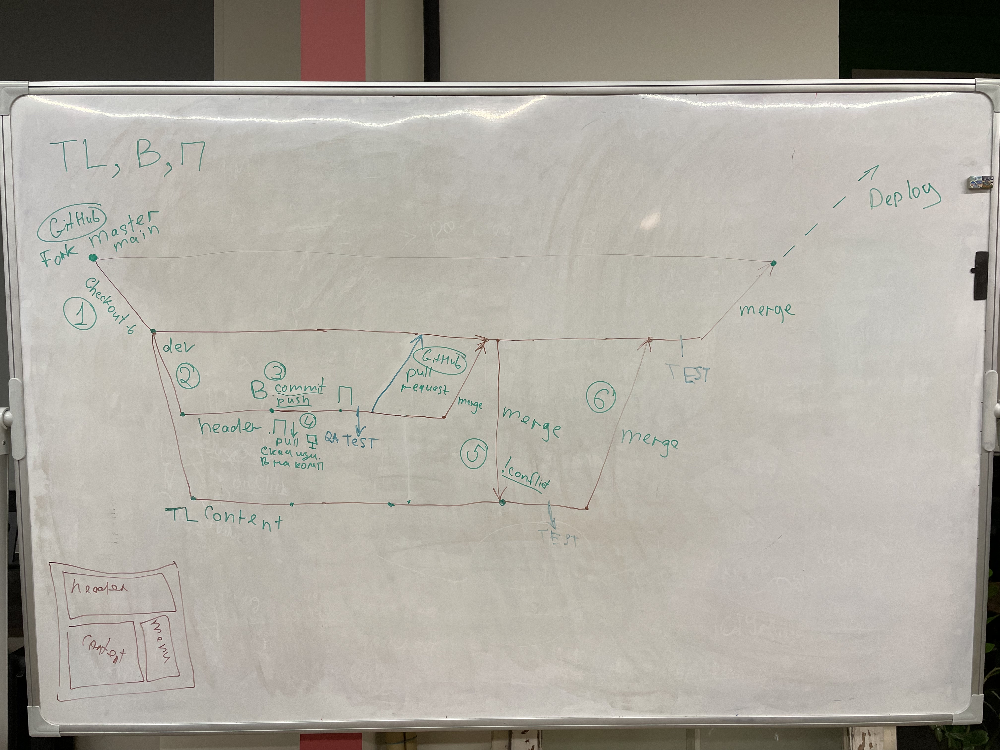

1. Fork/Import в GitHub
   1. Добавялем коллабораторов в GitHub
   2. `git clone https://github.com/mrThomasTeller/tmp-project-sudoku.git`
2. Создаём ветку dev `git checkout -b dev`
3. Создаём ветку header `git checkout -b header`
   1. вернёмся в ветку dev `git checkout dev`
   2. создаём ветку content `git checkout -b content`
   3. отправляем все ветки на сервер `git push` (надо зайти в каждую и сделать push)
4. Делаем изменения в ветке header.
   1. проверяем статус изменённых файлов `git status`
   2. добавляем файлы к коммиту `git add -A`
   3. создаём коммит `git commit -m "добавил в функцию solve console.log"`
   4. отправляем коммит на сервер `git push`
   5. если наткнулись на nano: `ctrl+x, Y, ctrl+o, enter`
   6. если наткнулись на VIM: `:q! enter`
5. попытались сделать push, но сначала надо сделать pull
   1. делаем `git pull`
   2. выбираем стратегию слияния `git config pull.rebase false`
   3. делаем `git push`
   4. Если наткнулись на конфликты (CONFLICT)
   5. Проверяем в каких файлах конфликты `git status`
   6. После решения конфликтов: `git add -A`, `git commit`, `git push`
   7. Делаем пул-реквест из GitHub
6. делаем мердж из ветки dev в ветку content
   1. `git checkout dev`
   2. `git pull`
   3. `git checkout content`
   4. `get merge origin dev`
   5. `git push`

Для того, чтобы откатиться на какой-то коммит: `git checkout [hash]`, [hash] - номер коммита
Для того, чтобы убрать все свои незакоммиченные изменения: `git reset --hard`
Для того, чтобы отменить коммит: `git revert [hash]`
