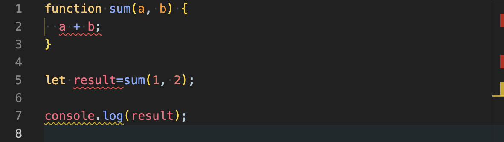
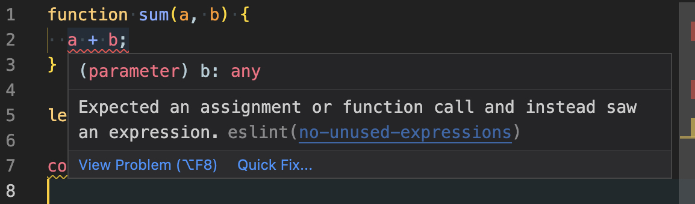
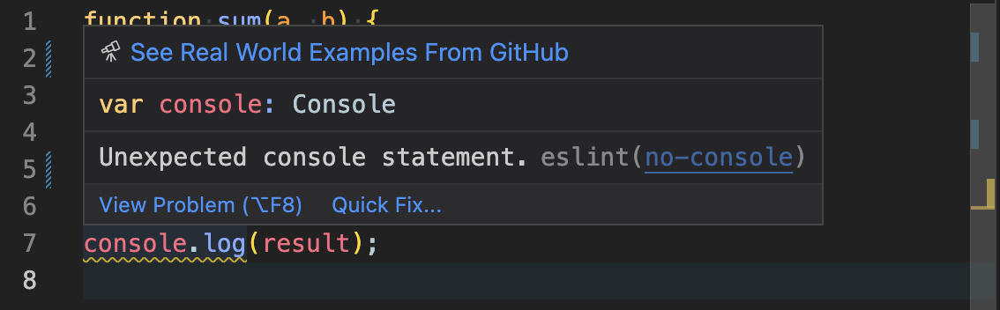
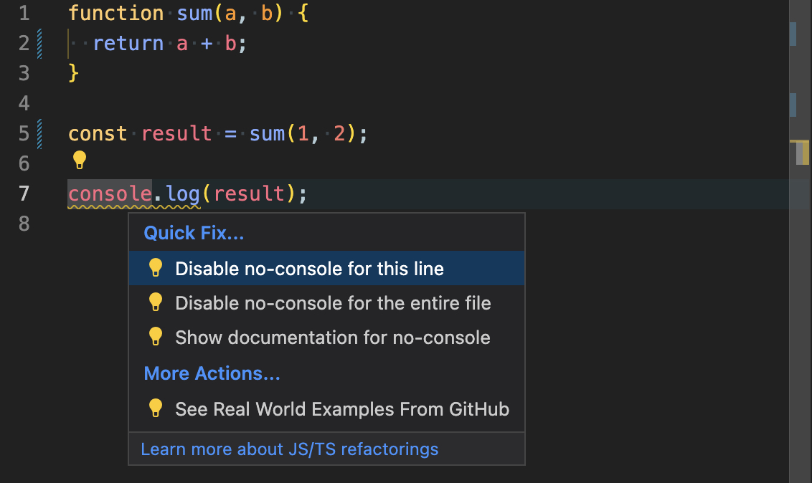

# 111. Материалы для самостоятельной подготовки

- [Обновление Node.js](#обновление-nodejs)
- [npx](#npx)
- [ESLint](#eslint)
- [devDependencies](#devdependencies)

## Обновление Node.js

Для того чтобы проверить версию Node.js, введи:

```bash
node -v
```

Проверь, чтобы версия Node.js была не ниже актуальной LTS версии. LTS версию можно посмотреть на главном сайте Node.js: https://nodejs.org/ru.

Чтобы обновить Node.js лучше всего воспользуйся инструментом `nvm`. Здесь написано как он устанавливается: https://github.com/nvm-sh/nvm#install--update-script (Для Linux и Mac), https://github.com/coreybutler/nvm-windows (Для Windows).

После установки введи для установки последней стабильной версии Node.js:

```bash
nvm install "lts/*" --reinstall-packages-from="$(nvm current)"
```

## npx

`npx` - это встроенный в `Node JS` инструмент, который позволяет запускать npm-пакеты прямо из командной строки. Причём эти пакеты даже не нужно заранее устанавливать через `npm install`. К примеру, попробуй запустить такую команду:

```bash
npx cat-me
```

Ты получишь рандомного котика у себя в командной строке. Обрати внимание “cat-me” - это название NPM-пакета. Или попробуй ввести такую команду. Вместо слова Elbrus можешь написать что угодно:

```bash
npx asciify Elbrus
```

И ты увидишь на экране твоё слово в стиле ASCII-art.

А теперь мы поговорим о нескольких полезных пакетах, которые ты будешь использовать через `npx`.

## ESLint

ESLint - это крайне полезный инструмент, который тебе нужно будет использовать на каждом своём проекте на протяжении всего обучения (а потом ты его так полюбишь, что и на протяжении всей жизни 😉). ESLint - это так называемый статический анализатор кода. Он анализирует твой код и показывает где в нём есть потенциальные ошибки. Так же он умеет проверять правильно ли отформатирован код. ESLint поможет тебе обнаружить и устранить множество багов ещё до первого запуска твоей программы.

ESLint нужно отдельно устанавливать в каждый проект. Для этого введи в командной строке:

```bash
npx eslint --init
```

Обрати внимание, в папке с проектом обязательно должен лежать файл package.json созданный ранее с помощью `npm init`. Во время установки ESLint выбери ответы:

- **How would you like to use ESLint?:** To check syntax, find problems, and enforce code style
- **What type of modules does your project use?:** CommonJS (require/exports)
- **Which framework does your project use?:** None of these
- **Does your project use TypeScript?:** No
- **Where does your code run?:** Node _(Надо пробелом снять галочку с Browser, а потом также поставить её на Node)_
- **How would you like to define a style for your project?:** Use a popular style guide
- Airbnb
- **What format do you want your config file to be in?:** JavaScript
- **Would you like to install them now?:** Yes
- **Which package manager do you want to use?:** npm

Для примера рассмотрим такой код:



Как видишь ESLint подсветил ошибки в этом коде. ВАЖНО! Избавляйся от всех ошибок ESLint в твоём коде, чтобы как можно меньше багов встретить после запуска программы. Если навести курсор на первую ошибку то вот что ты увидишь:



Тебе может не сразу понятно, что именно от тебя хочет ESLint. Чтобы прочитать подробное описание этой ошибки можно кликнуть на ссылку с её именем (no-unused-expression). В итоге ты поймёшь, что тут забыли написать `return` перед `a + b;`. Вставляем `return` и ошибка пропадает.

Также ESLint умеет исправлять некоторые ошибки самостоятельно. Нажми `ctrl+shift+P` (`⌘+shift+P` для мака) появится панель команд VS Code. Введи `fix all` и выбери команду `ESLint: fix all auto-fixable problems`. Обрати внимание, что ещё две ошибки в файле теперь исправлены.

У нас осталась последняя ошибка (а точнее предупреждение, потому что оно подчёркивается оранжевым, а не красным цветом):



Как видим правило называется `no-console`. ESLint предупреждает нас о том, что возможно мы оставили лишний `console.log`. Это правило ESLint лучше вообще отключить (по крайней мере на первой фазе). Это можно сделать несколькими способами:

1. Отключить предупреждение только для 7-ой строки. Нажимаем `ctrl+.` (`⌘+.`) и выбираем пункт `Disable no-console for this line`.



2. Отключить предупреждение для всего файла. Нажимаем `ctrl+.` (`⌘+.`) и выбираем пункт `Disable no-console for the entire file`.

3. Самое удобное: отключить предупреждение для всего проекта. Для этого идём в файл `.eslintrc.js` и в секцию rules вписываем:

```js
rules: {
  "no-console": 0, // так отключаем правило no-console для всего проекта
},
```

## devDependencies

Если после установки ESLint ты зайдёшь в файл package.json ты увидишь, что пакеты eslint указаны не в секции `dependencies` как все остальные установленные пакеты, а в секции `devDependencies`. Это означает, что эти пакеты являются зависимостями только для разработки. То есть они будут устанавливаться только когда ты разрабатываешь своей проект. Когда проект будет развёрнут на продакшене (для использования реальными пользователями) то эти пакеты не будут установлены. В результате это ускорит сборку продакшен-билда и сэкономит место на продакшен-сервере (где будет развёрнут проект).

Чтобы установить любой пакет как dev-зависимость (в `devDependencies`) пропиши команду установки с ключом `-D`:

```bash
npm install some-package -D
```

Здесь `some-package` - это название пакета, который ты хочешь установить.
